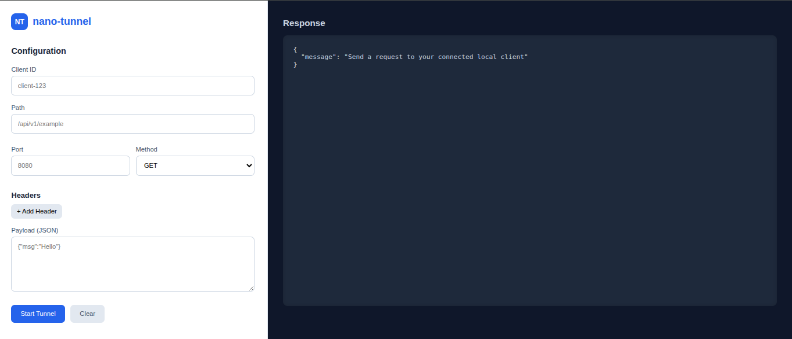

# Nano-tunnel

**Nano-tunnel** is a simple CLI tool that forwards requests to your local ports from the internet, allowing you to access your local development environments remotely.



---


## Installation

### Install from hosted binary (no Go required)

```bash
curl -fsSL https://nano-tunnel.onrender.com/install.sh | bash
```

### Verify installation

```bash
nano-tunnel --help
```

### To uninstall

```bash

sudo rm -f /usr/local/bin/nano-tunnel

```

---


## Usage

1. Create a configuration file `your_config_file.json`:

```json
{
  "remote_url": "nano-tunnel.onrender.com"
}
```

2. Start the CLI and connect your device:

```bash
nano-tunnel start ./your_config_file.json
```

3. Copy your **Client ID** from the terminal and use it on the hosted Nano-tunnel client website to forward requests to your device.

---

## License

MIT License